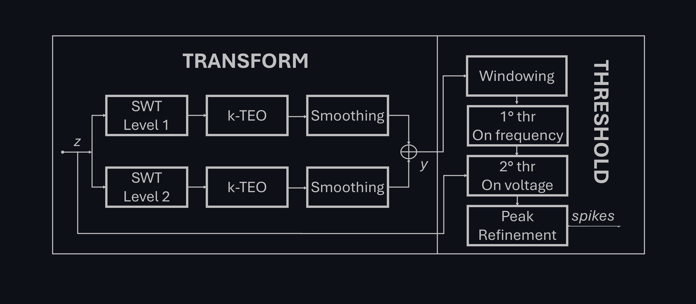

# Adaptive-SWTTEO
Matlab-based single-channel spike detection algorithm for extracellular neural recordings. 

The algorithm is composed of these steps: 
1. Stationary Wavelet transform (SWT) of n-th level. 
2. Mantaining only approximation coefficient at each level.
3. k-Teager Energy Operator (or k-TEO/k-NEO).  
4. Smoothing (k-SNEO).
5. Summation of all the transformed signals at each level.
6. Threshold with a windowed quantile function.
7. Peak refinement.
   
The code is inspired from the SWTTEO algorithm presented in _Florian Lieb, Hans-Georg Stark, and Christiane Thielemann. “A Stationary Wavelet Transform and a Time-Frequency Based Spike Detection Algorithm for Extracellular Recorded Data”. In: J Neural Eng 14.3 (June 2017). DOI: 10.1088/1741-2552/aa654b_. Key modifications are made from the third step till the end. Since SWTTEO had been benchmarked against multiple existing single-channel spike detection algorithms, demonstrating superior performance, our improved algorithm establishes itself as a leading solution in the field.



### Usage
#### Input parameters:
data: Input single-channel signal (1xN or Nx1 vector)
fs: Sampling frequency in Hz

#### Optional parameters (name-value pairs):
wavLevel: Wavelet decomposition level (default: 2)
waveName: Wavelet type (default: 'sym5')
winType: Function handle for smoothing window (default: @hamming)
smoothN: Size of the smoothing operator in ms (default: 1, set to 0 to turn off)
winPars: Optional parameters for the smoothing window (default: {'symmetric'})
RefrTime: Refractory time in ms (default: 0.5)
MultCoeff: Multiplication coefficient for SWTTEO thresholding (default: 6)
Polarity: Spike polarity: -1 for negative, 1 for positive (default: -1)
PeakDur: Max peak duration (pulse lifetime) in ms (default: 2.3)
medWdw: Window length for moving quantile in seconds (default: 0.003)
k: Number of samples for TEO (default: 3)
overshoot: Secondary window length for boundary control in seconds (default: 0.0007)

#### Output parameters:
ts: Timestamps of the detected spikes stored in 1xNspks vector.
p2pamp: peak-to-peak amplitude
pmin: amplitude in volt at spike's positions
p2pamp: peak-to-peak amplitude
p2pamp: peak-to-peak amplitudeease. Decreasing this factor makes it more
%       sensitive to detect spikes.

### Exaples
```matlab
[ts,p2pamp,pmin,pW,E] = AdSWTTEO(data, fs);  % using default parameters    
% Using name-value pairs for custom parameters
[ts,p2pamp,pmin,pW,E] = AdSWTTEO(data, fs, 'MultCoeff', 8, 'RefrTime', 1);
```
Set parameters that best fit with your data, especially the `pars.MultCoeff`, which is the coefficient multiplying the second global threshold. The other outputs are (in order): the peak-to-peak amplitude, the peak value of the spike, the spike duration and the energy value at spike's positions.

