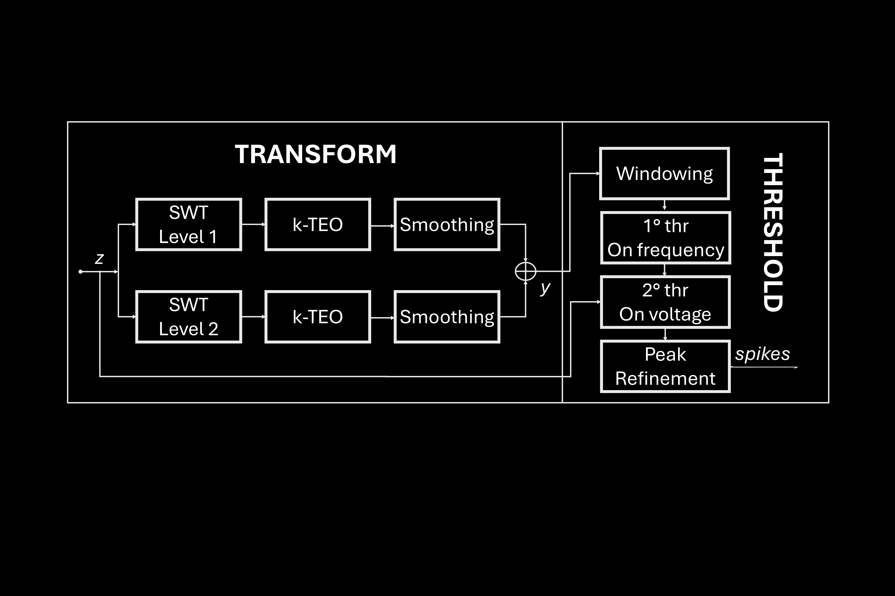

# Adaptive-SWTTEO
Matlab-based single-channel spike detection algorithm for extracellular neural recordings. 

The algorithm is composed of these steps: 
1. Stationary Wavelet transform (SWT) of n-th level. 
2. Mantaining only approximation coefficient at each level.
3. k-Teager Energy Operator (or k-TEO/k-NEO).  
4. Smoothing (k-SNEO).
5. Summation of all the transformed signals at each level.
6. Threshold with a windowed quantile function.
7. Peak refinement.
   
The code is inspired from the SWTTEO algorithm presented in _Florian Lieb, Hans-Georg Stark, and Christiane Thielemann. “A Stationary Wavelet Transform and a Time-Frequency Based Spike Detection Algorithm for Extracellular Recorded Data”. In: J Neural Eng 14.3 (June 2017). DOI: 10.1088/1741-2552/aa654b_. Key modifications are made from the third step till the end. Since SWTTEO had been benchmarked against multiple existing single-channel spike detection algorithms, demonstrating superior performance, our improved algorithm establishes itself as a leading solution in the field.



### Usage
To detect spikes you can just call `[ts, ~, ~, ~, ~] = AdSWTTEO(data)` to use the default parameters written in `pars_AdSWTTEO`, inserting your sampling rate as `pars.fs`. You can modify this function to use different parameters. The best procedure to adopt is:
```matlab
pars = pars_AdSWTTEO;
pars.fs = [yourSamplingRate];
[ts,p2pamp,pmin,pW,E] = AdSWTTEO(data,pars);
```
Set parameters that best fit with your data, especially the `pars.MultCoeff`, which is the coefficient multiplying the second global threshold. The other outputs regards (in order): the peak-to-peak amplitude, the peak value of the spike, the spike duration and the energy value at spike's positions.

### Credits
Peter O'Connor (2025). PeakSeek (https://www.mathworks.com/matlabcentral/fileexchange/26581-peakseek), MATLAB Central File Exchange. 
